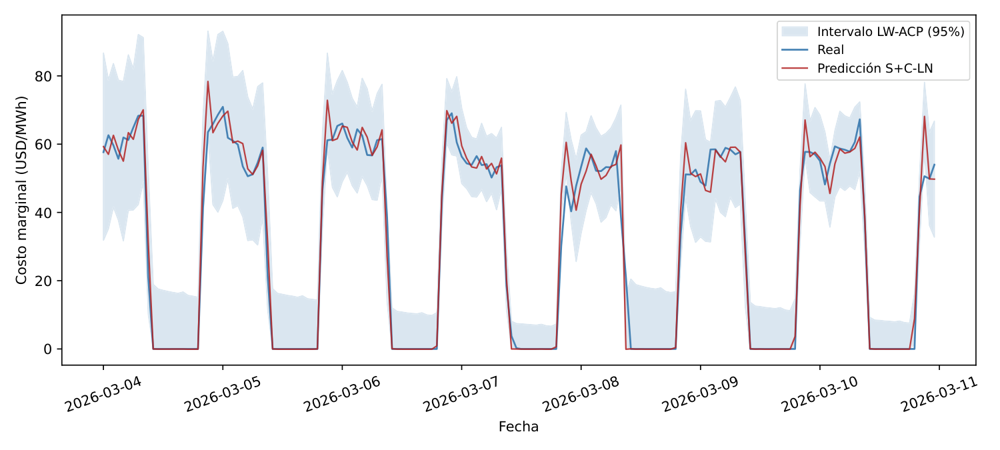
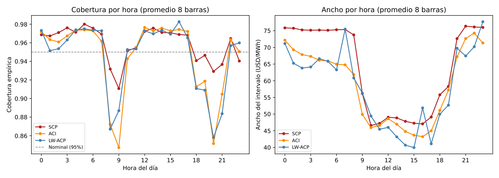
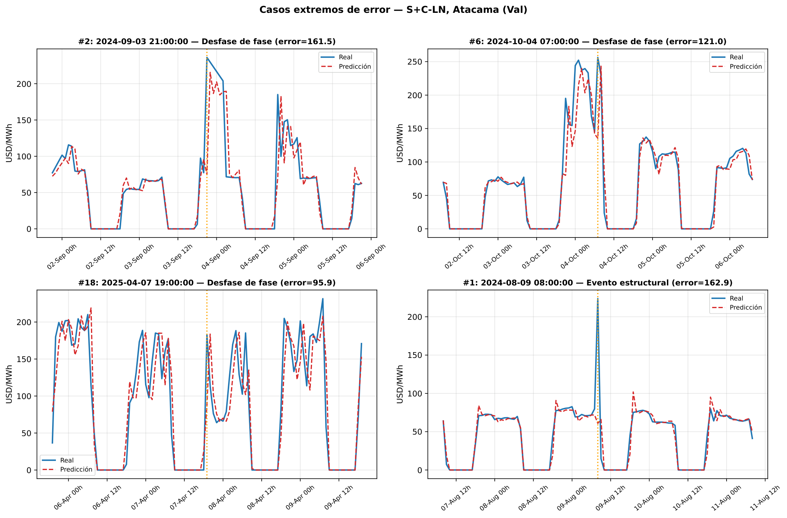

# Forecasting Chile's Hourly Marginal Electricity Cost with a Temporal Fusion Transformer

[-blue)](Escrito/main.pdf)


Code, data and LaTeX source for my thesis:

> **Posición Solar, Descomposición Estadística y Cuantificación de Incertidumbre mediante
> Temporal Fusion Transformer para el Forecasting del Costo Marginal en el SEN**
> *(Solar position, statistical decomposition and uncertainty quantification with a Temporal
> Fusion Transformer for forecasting the marginal cost in Chile's National Electric System)*
>
> Edward Benjamín Mitchell García. Thesis for the degrees of Ingeniero Civil en Matemáticas and
> Magíster en Matemáticas Aplicadas, Departamento de Ingeniería Matemática, Universidad de Chile.
> Advisor: Alejandro Jofré Cáceres. **Under final review.**

<p align="center">
  
</p>
<p align="center"><sub>One week at the Atacama busbar (March 2026): real cost (blue), forecast (red) and the
95% LW-ACP interval, which narrows when solar oversupply drives the price to zero and widens at
the solar transitions. Axis labels are in Spanish, as in the thesis.</sub></p>

## The problem

Chile's National Electric System (SEN) moved quickly toward solar generation. The hourly marginal
cost now drops to 0 USD/MWh in the middle of most days and spikes during scarcity or transmission
congestion, which makes it much harder to forecast with classical statistical methods.

This work forecasts the **hourly marginal cost at eight representative 220 kV busbars** (Atacama,
Cardones, Charrúa, Crucero, Pan de Azúcar, Puerto Montt, Quillota and Tarapacá), January 2020 to
April 2026, about 55,000 hours per busbar, using data from the
[Coordinador Eléctrico Nacional](https://www.coordinador.cl) and weather from the
[Open-Meteo](https://open-meteo.com) archive (ERA5).

## Approach

* **Temporal Fusion Transformer (TFT)**, one model per busbar, one hour ahead.
* **Two exogenous feature strategies**:
  * **P+C (Prophet + weather):** Prophet's trend and seasonal components as known inputs,
    combined with a residual TFT through *Stacking Optimization*.
  * **S+C (sun + weather):** replaces the Prophet decomposition with deterministic **solar
    position** features (solar elevation, its cosine, daylight saving time) computed from each
    busbar's geolocation.
* **Two normalization layers** inside the Transformer: LayerNorm (LN) and Dynamic Tanh (DyT).
* **LW-ACP (Locally-Weighted Adaptive Conformal Prediction)**, proposed here: prediction intervals
  that combine hour-of-day weighting of the uncertainty with online adaptation of the coverage
  level.
* Model comparisons use the **Diebold–Mariano test** with Newey–West variance.

## Key results

All numbers are test-set results taken from the thesis.

**The simpler strategy wins.** S+C beats P+C in **14 of 16** busbar-architecture combinations,
13 of them statistically significant. The solar position signal is at least as informative as
Prophet's statistical decomposition.

**It beats the system operator's own forecast.** Against the scheduled marginal cost that the CEN
publishes operationally, S+C-LN reduces the mean absolute error by **52–61%**:

| Busbar | MAE (this work) | MAE (CEN) | Improvement |
|---|---:|---:|---:|
| Crucero | 6.74 | 17.10 | 60.6% |
| Puerto Montt | 13.68 | 32.98 | 58.5% |
| Cardones | 6.63 | 14.52 | 54.4% |
| Pan de Azúcar | 6.93 | 15.09 | 54.1% |
| Charrúa | 7.98 | 17.01 | 53.1% |
| Quillota | 8.26 | 17.26 | 52.1% |

<sub>MAE in USD/MWh over the full test set (8,298 hours per busbar).</sub>

Compared with recent classical machine learning work on the same market, the model reduces MAE by
**20–34%** on the busbars evaluated by both.

**Sharper uncertainty, same coverage.** LW-ACP gives intervals up to 16% narrower than classical
Split Conformal Prediction, with empirical coverage within half a percentage point of the 95%
target at all eight busbars:

| Method | Mean width (USD/MWh) | Mean \|coverage − 0.95\| | Mean Winkler score |
|---|---:|---:|---:|
| Split CP | 63.80 | 0.0089 | 100.78 |
| ACP (γ = 0.05) | 58.70 | 0.0038 | 90.64 |
| **LW-ACP (γ = 0.05)** | **58.25** | **0.0038** | **89.89** |
| CQR | 67.99 | 0.0081 | 96.50 |

<p align="center">
  
</p>

**Where the model fails.** Most of the largest errors are a **phase shift of about one hour** in
the daily solar transition (the model predicts the price jump one hour early or late), a pattern
that appears at all eight busbars. Puerto Montt, driven by hydro generation, remains unresolved:
none of the hydrological features tried improved on the general strategy. LayerNorm beats Dynamic
Tanh consistently, but by a small margin.

<p align="center">
  
</p>

## Repository layout

```
Escrito/                  LaTeX source of the thesis and the compiled PDF (main.pdf)
Modulos/                  Python modules: data loading, preprocessing, Prophet, TFT,
                          DyT, stacking, evaluation and conformal prediction
Multi_modelo TFT *.ipynb  main experiment notebooks (hourly, daily, test runs)
Exploracion_Resultados.ipynb   results exploration
Scripts/                  analysis and plotting scripts
Scripts Cluster/          training and evaluation jobs for the university cluster (SLURM)
Multi-Modelos_TFT/        model configurations, metrics and conformal prediction results,
                          by granularity (h = hourly, D = daily, 15min) and architecture
Modelos_Prophet/          Prophet hyperparameters and component plots
Datos/                    marginal cost (hourly, daily, 15-minute), weather and hydrological data
docs/                     seminar slides, literature notes and README figures
```

## Reproducing

The exact environment is pinned in [`requirements.lock.txt`](requirements.lock.txt)
(PyTorch Lightning, PyTorch Forecasting, Prophet):

```bash
python -m venv venv_tesis && source venv_tesis/bin/activate
pip install -r requirements.lock.txt
```

The EnbPI baseline in `Modulos/Conformal_Prediction_Wrapper.py` uses M. Zaffran's
[AdaptiveConformalPredictionsTimeSeries](https://github.com/mzaffran/AdaptiveConformalPredictionsTimeSeries),
cloned into the repository root. Run the notebooks from the repository root: every path is
relative to it. Trained checkpoints and TensorBoard logs are not versioned; the notebooks and the
scripts in `Scripts Cluster/` regenerate them.

## License

The code is released under the [MIT License](LICENSE). The thesis text, figures and PDF remain
© Edward Benjamín Mitchell García. The LaTeX class in `Escrito/` belongs to FCFM, Universidad de
Chile, under its own license ([`Escrito/LICENSE`](Escrito/LICENSE)).
